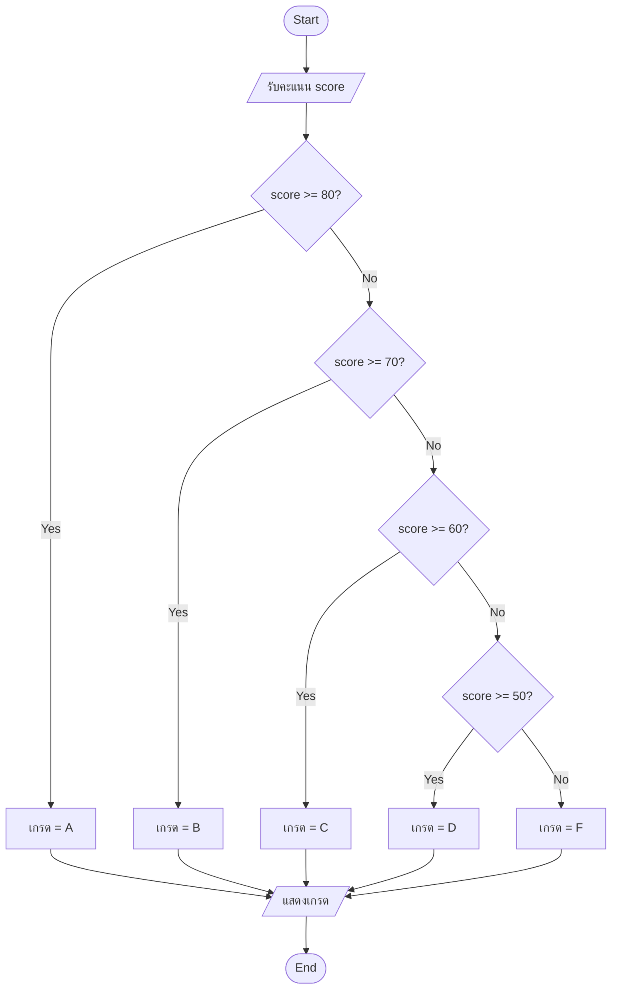
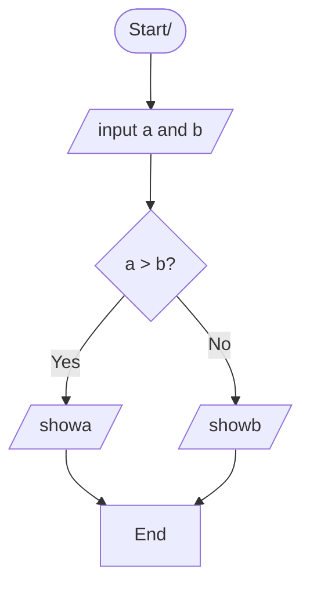
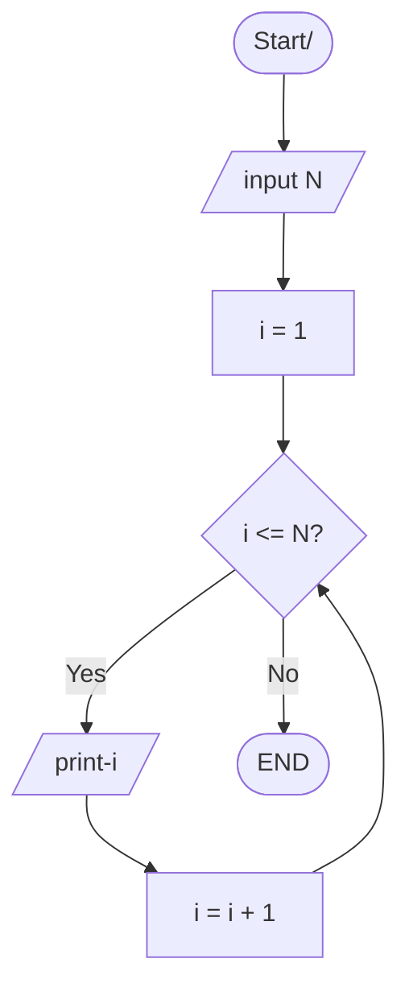

```mermaid
flowchart TD
Start([Start]) --> Input[/รับคะแนน score/]
Input --> D1{score >= 80?}
D1 -->|Yes| A[เกรด = A]
D1 -->|No| D2{score >= 70?}
D2 -->|Yes| B[เกรด = B]
D2 -->|No| D3{score >= 60?}
D3 -->|Yes| C[เกรด = C]
D3 -->|No| D4{score >= 50?}
D4 -->|Yes| D[เกรด = D]
D4 -->|No| F[เกรด = F]
A & B & C & D & F --> Output[/แสดงเกรด/]
Output --> End([End])
```

```mermaid
flowchart TD
start([Start/])
-->input[/input a and b/] 
-->deci{a > b?} 
deci-->|Yes|showa[/showa/]
deci-->|No|showb[/showb/]
showa-->End
showb-->End

```

```mermaid
  flowchart TD
start([Start/])
-->input[/input N/] 
-->proi[i = 1]
-->deci{i <= N?}
deci-->|Yes|print[/print-i/]
-->pro[i = i + 1]-->
deci-->|No|No([END])


```
