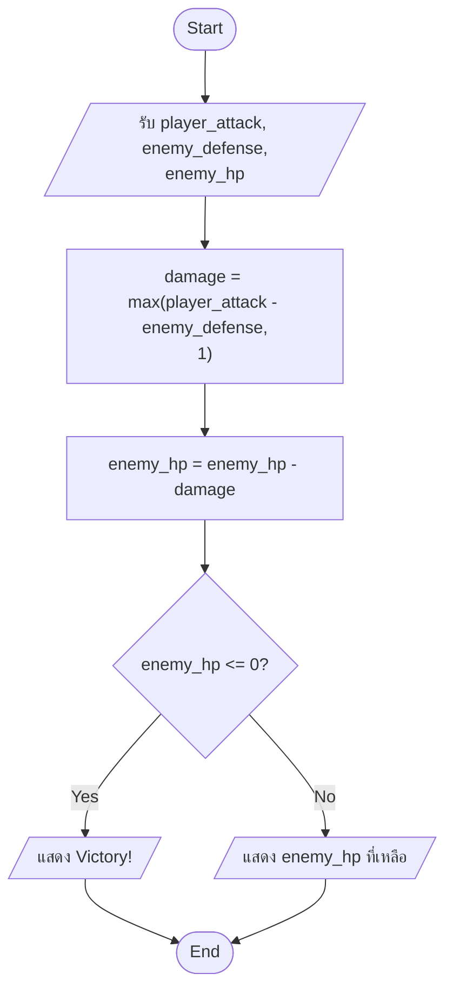
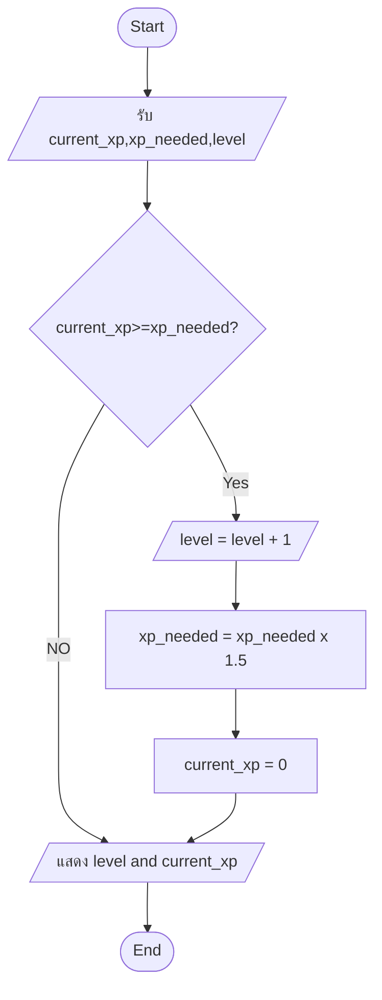

```mermaid
flowchart TD
Start([Start]) --> Input[/รับ player_attack, enemy_defense,
enemy_hp/]
Input --> Calc["damage = max(player_attack - enemy_defense,
1)"]
Calc --> Reduce["enemy_hp = enemy_hp - damage"]
Reduce --> D1{enemy_hp <= 0?}
D1 -->|Yes| Win[/แสดง Victory!/]
D1 -->|No| Show[/แสดง enemy_hp ที่เหลือ/]
Win & Show --> End([End])
```

```mermaid
flowchart TD
Start([Start]) --> Input[/รับ current_xp,xp_needed,level/] 
Input --> input{current_xp>=xp_needed?}
input-->|Yes|2[/level = level + 1/]
2-->3[xp_needed = xp_needed x 1.5]
3-->5[current_xp = 0]
input-->|NO|output[/แสดง level and current_xp/]
5-->output
 
--> End([End])
```
